# 베네핏데이

## 카테고리

| Application      | Domain            | Language     | Framework           |
| ---------------- | ----------------- | ------------ | ------------------- |
| ✅ Desktop Web    | 🔲 AI              | 🔲 JavaScript | 🔲 Vue.js            |
| 🔲 Mobile Web     | ✅  Big Data       | ✅ TypeScript | ✅ React.js          |
| 🔲 Responsive Web | 🔲 Blockchain      | 🔲 C/C++      | 🔲 Angular           |
| 🔲 Android App    | 🔲 IoT             | 🔲 C#         | 🔲 Node.js           |
| 🔲 iOS App        | 🔲 AR/VR/Metaverse | 🔲 Python     | 🔲 Flask/Django      |
| 🔲 Desktop App    | 🔲 Game            | ✅ Java       | ✅ Spring/Springboot |
|                  |                   | 🔲 Kotlin     |                     |

## 프로젝트 소개

- 프로젝트명: 베네핏 데이
- 서비스 특징: 정책 추천 서비스
- 주요 기능
  - 계정 관리
  - 검색 기능
  - 추천 기능(컨텐츠 기반 필터링 (Contents-based Filtering))
  - 정책 상세정보에 리뷰 CRUD
  - 좋아요 기능
  - 정책 게시판에 CRUD
- 주요 기술
  - Single Page Application
  - REST API
  - Big Data

## 팀 소개

### 프론트엔드

- 김민정:
- 장영윤: 퇴소
- 임현모

### 백엔드

- 최대호
- 맹주영: 퇴소
- 배준호:퇴소

## 프로젝트 상세 설명

### 개발 환경

- VScode
- IntelliJ

### 기술 스택

- React, Redux, React-router
- TypeScript
- Java
- Spring-Boot

### 협업 툴

- Git, Jira
- Confluence
- 구글문서, figma

### 프로젝트 구조

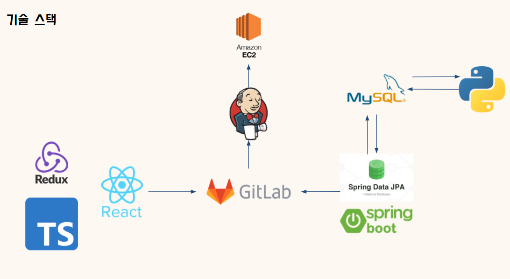

### WireFrame

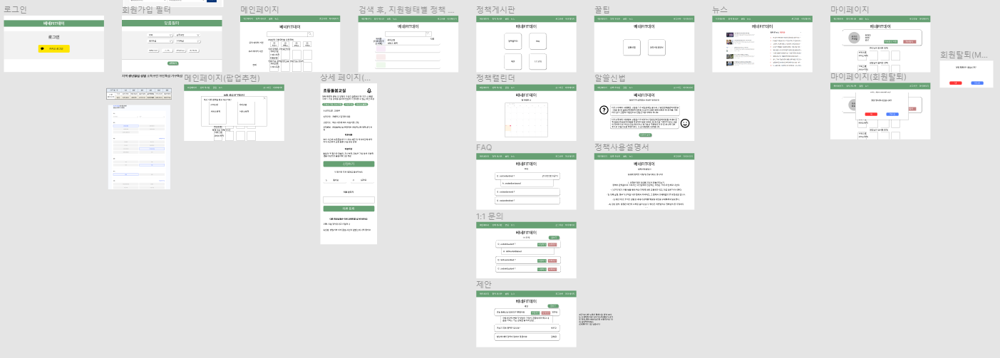

### ERD

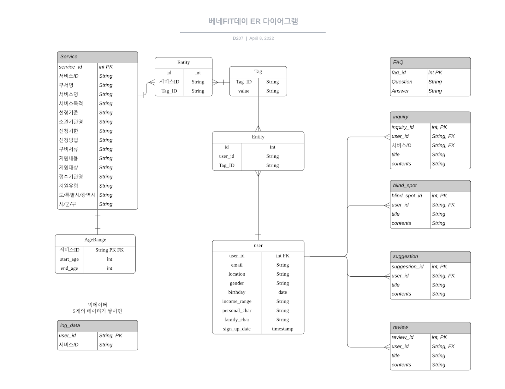

### 기능 상세 설명

#### 추천 알고리즘

- 컨텐츠 기반 필터링 (Contents-based Filtering)
  - 각각의 정책 데이터에 태그를 달아서 태그를 이용해 유사도가 높은 정책을 추천해 주는 알고리즘입니다. 
  - 저희 프로젝트에서 유저의 맞춤필터는 태그와 동일한 범위에서 지정되기 때문에 특정 유저를 맞춤필터에 해당하는 태그를 가진 정책으로 취급해서 그 유저와 유사도가 높은 정책을 추천하게 하는 알고리즘을 이용하였습니다.

#### 정책 검색

- 추천받은 정책 외에 찾고싶은 정책들 조회

#### 지원형태별 정책

- 추천받은 정책들 중 현금,현물,상담 등 지원해주는 형태별로 분류

#### 조회수 정책

- 모든 사용자가 열람한 조회수를 기반한 정책 제공함으로써 현재 이슈되고 있는 정책 알수있음

#### 계정관리

- 정책 상세페이지에서 좋아요를 누르면 마이페이지에서 따로 모아볼수 있어서 스크랩 역할을 함

#### 상세페이지

- 모든 정책들은 클릭시 상세페이지 제공
- 해당 페이지에서 신청하로 갈수 있는 URL 제공
- 의견을 남길 수 있는 공간을 만들어 사용자들의 의견을 볼 수 있음

# 사용 예시

# 로그인

- 서비스를 이용하려면 먼저 회원가입, 로그인 절차가 필요

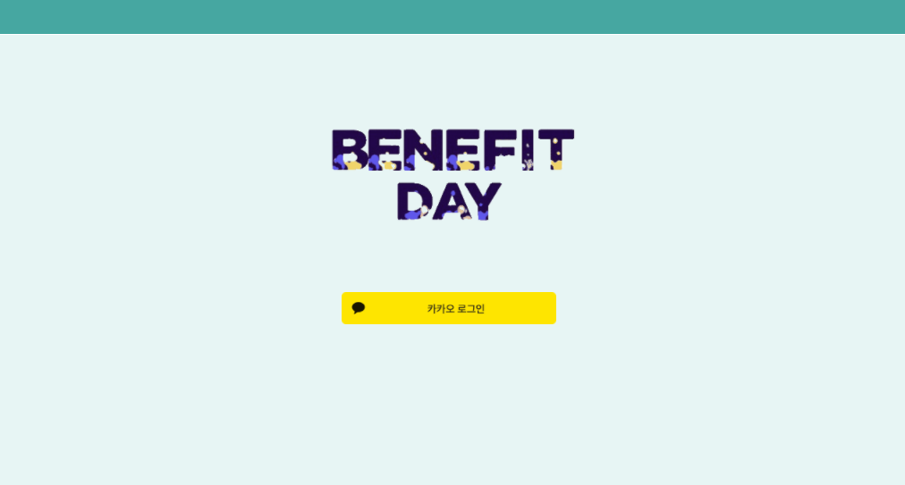

# 맞춤필터

- 최초로 회원가입하고 나면 정책을 추천 받기위해 필터를 입력

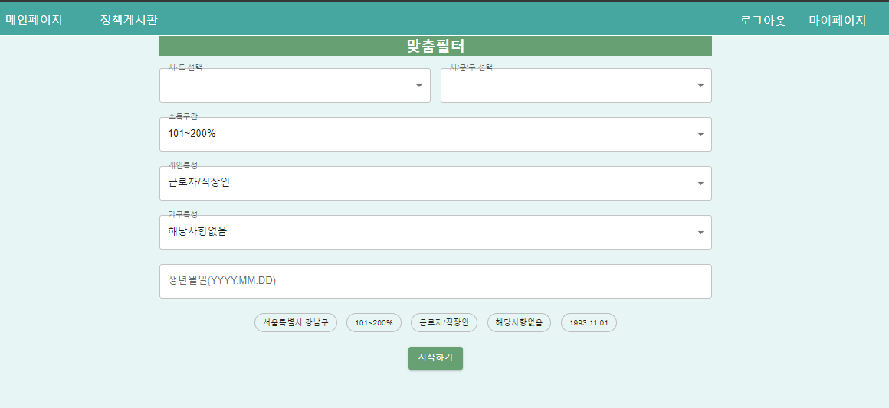

# 메인페이지

- 모든 정책들 중 키워드로 찾고싶은 정책을 검색
- 추천 정책 중 지원 형태별 정책들 모아보기
- 입력한 필터로 기반한 추천 정책
- 모든 사용자가 열람한 조회수를 이용한 추천정책

위의 4가지 기능을 메인페이지에서 이용 가능

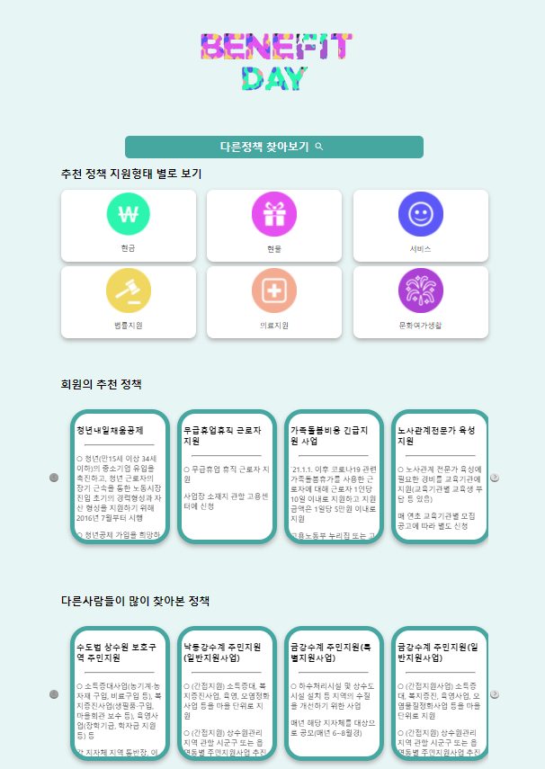

# 정책 검색

- 메인페이지에서 검색버튼을 누르고 정책검색 페이지로 이동
- 키워드를 입력하여 모든 정책중 해당 키워드에 맞는 정책을 출력

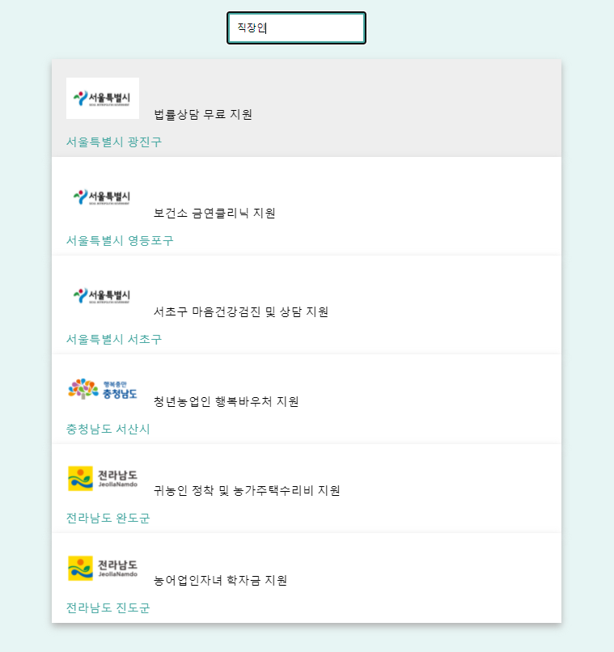

# 지원 형태별 정책

- 추천받은 정책중 원하는 지연형태별 정책을 클릭해서 조회 가능

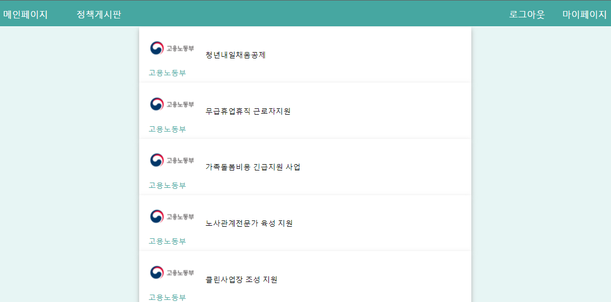

# 상세 페이지 조회

- 메인페이지, 검색, 지원형태별 정책등 정책이 보여지는 모든 곳에서 정책을 클릭하면 상세페이지 조회 가능
- 상세페이지에서 신청하로 갈수 있는 버튼 제공
- 해당 정책이 도움되었는지 의견을 반영할수 있게 좋아요 기능과 댓글 기능 구현

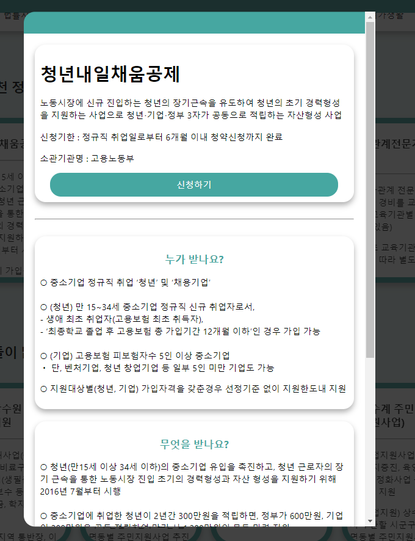

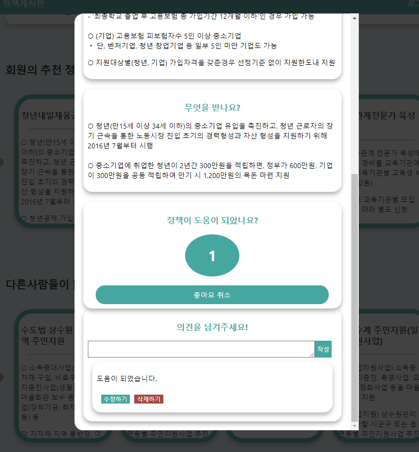

# 정책 게시판

- 미리 등록된 FAQ를 조회
- 1:1 문의 게시판에 문의사항 등록 가능
- 제안 게시판에 자유롭게 글작성 가능

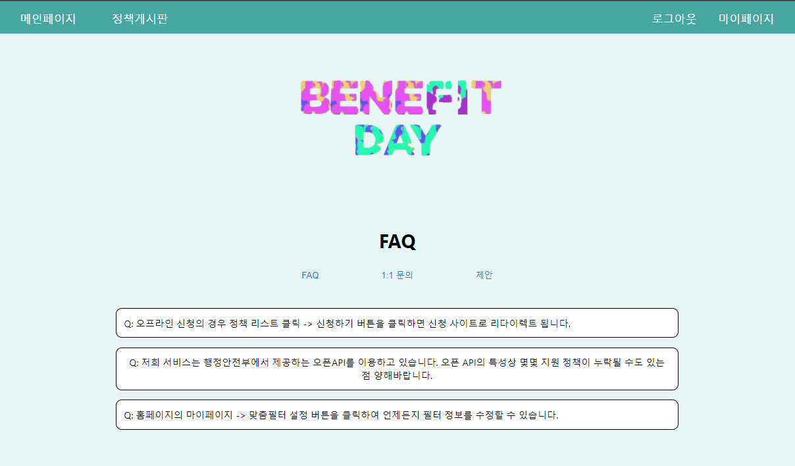

# 마이페이지

- 자신의 프로필 확인 가능
- 회원탈퇴 기능 구현
- 맞춤필터를 수정할수 있음
- 좋아요 한 정책들을 따로 모아 볼 수 있고 클릭시 상세페이지 제공

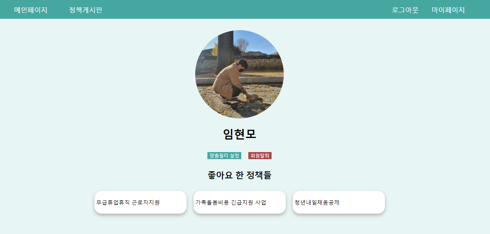

