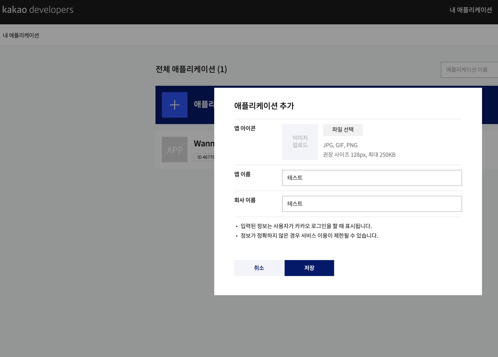
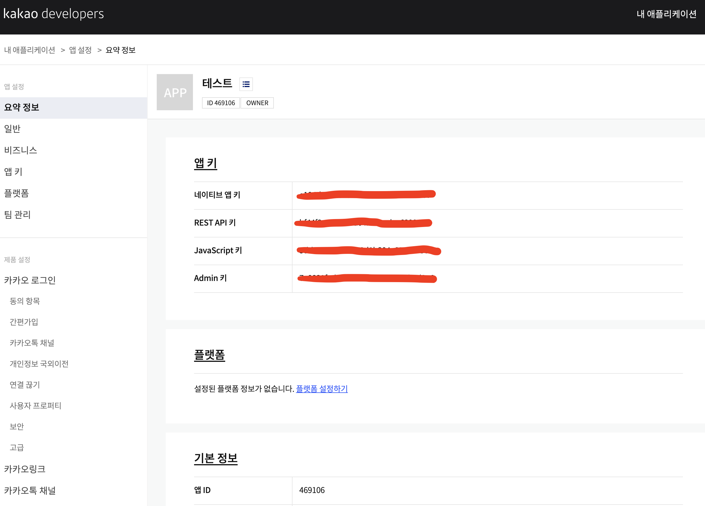
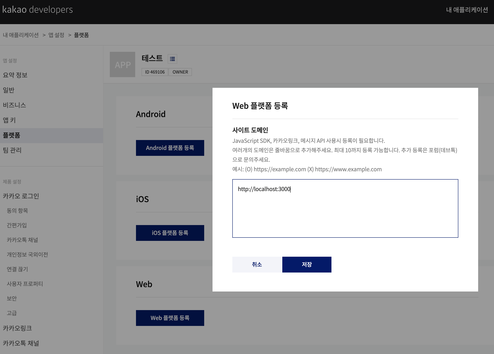
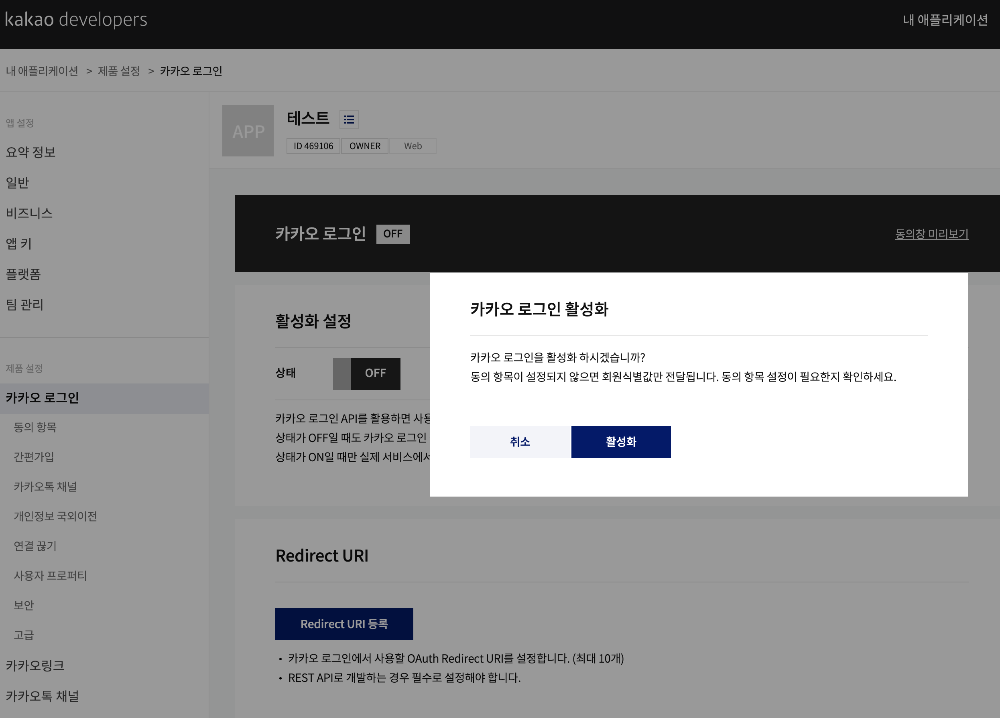
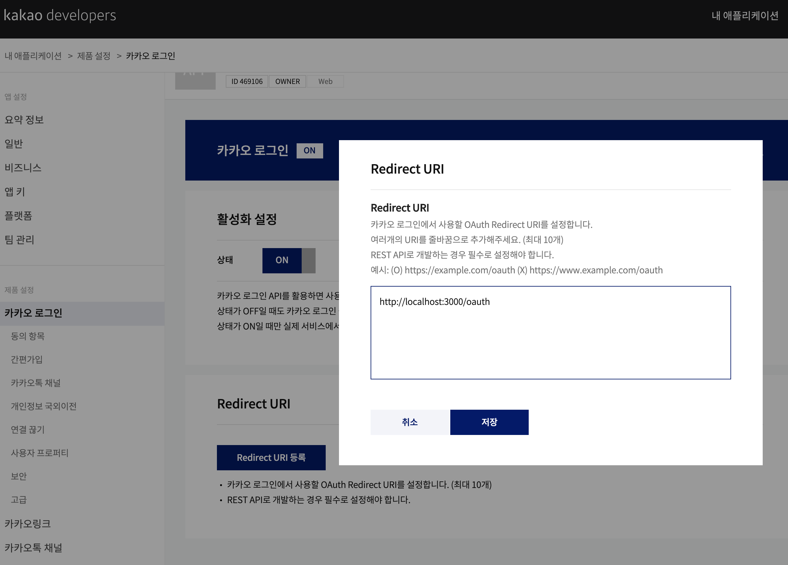
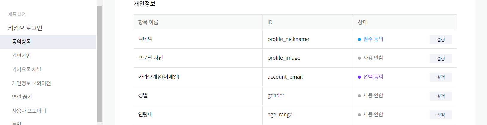
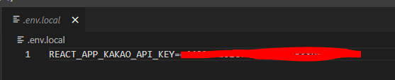

# 소셜 로그인(카카오)

https://developers.kakao.com/

카카오 개발자 사이트 접속

## 1. 애플리케이션 추가

## 2. REST API 키 복사

## 3. WEb 플랫폼 등록해서 http://localhost:3000 입력

## 4. 카카오 로그인 활성화 설정 상태 ON

## 5. 이어서 Redirect URI에 http://localhost:3000/oauth 입력

## 6. 이러한 동의항목에서 닉네임,프로필사진,이메일 동의하기

## 7. 이후 .env.local 생성 후에 해당파일 안에 변수와 앱키를 넣어주면 된다.

