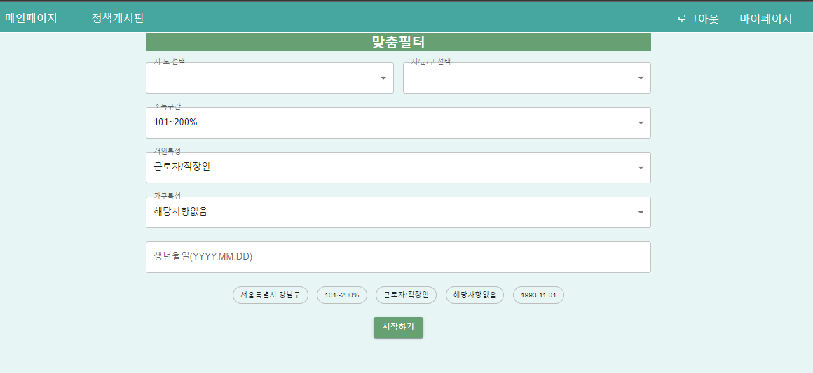
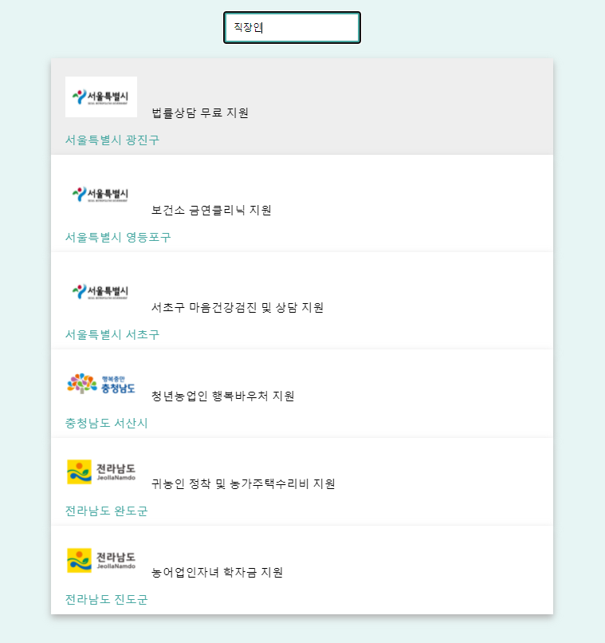
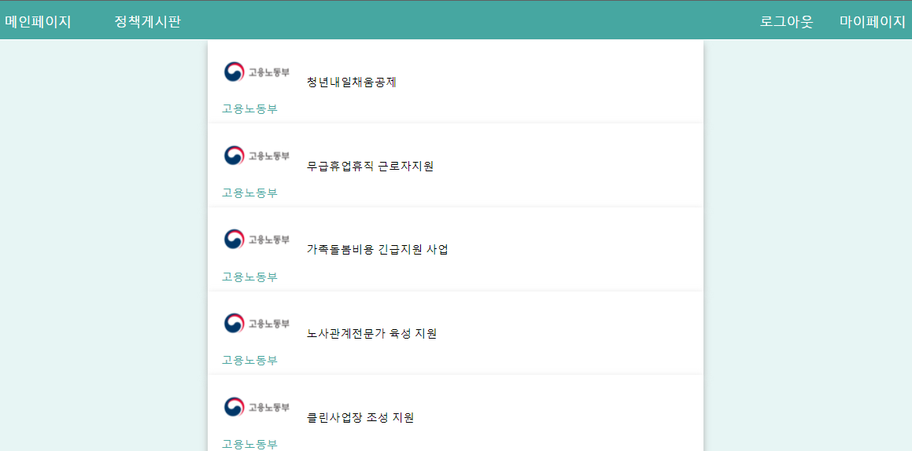
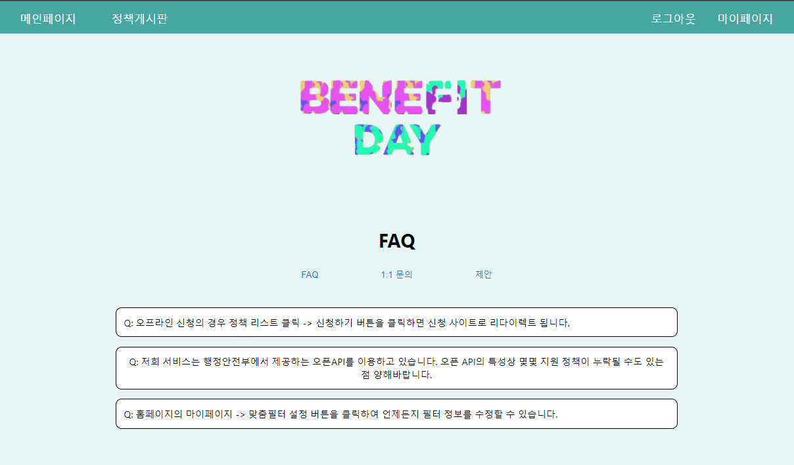
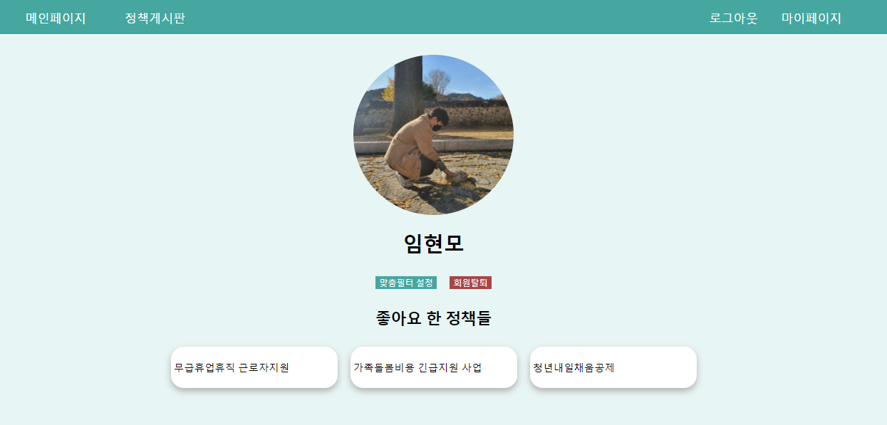

# 로그인

- 서비스를 이용하려면 먼저 회원가입, 로그인 절차가 필요

# 맞춤필터

- 최초로 회원가입하고 나면 정책을 추천 받기위해 필터를 입력

# 메인페이지

- 모든 정책들 중 키워드로 찾고싶은 정책을 검색
- 추천 정책 중 지원 형태별 정책들 모아보기
- 입력한 필터로 기반한 추천 정책
- 모든 사용자가 열람한 조회수를 이용한 추천정책

위의 4가지 기능을 메인페이지에서 이용 가능

# 정책 검색

- 메인페이지에서 검색버튼을 누르고 정책검색 페이지로 이동
- 키워드를 입력하여 모든 정책중 해당 키워드에 맞는 정책을 출력

# 지원 형태별 정책

- 추천받은 정책중 원하는 지연형태별 정책을 클릭해서 조회 가능

# 상세 페이지 조회

- 메인페이지, 검색, 지원형태별 정책등 정책이 보여지는 모든 곳에서 정책을 클릭하면 상세페이지 조회 가능
- 상세페이지에서 신청하로 갈수 있는 버튼 제공
- 해당 정책이 도움되었는지 의견을 반영할수 있게 좋아요 기능과 댓글 기능 구현

# 정책 게시판

- 미리 등록된 FAQ를 조회
- 1:1 문의 게시판에 문의사항 등록 가능
- 제안 게시판에 자유롭게 글작성 가능

# 마이페이지

- 자신의 프로필 확인 가능
- 회원탈퇴 기능 구현
- 맞춤필터를 수정할수 있음
- 좋아요 한 정책들을 따로 모아 볼 수 있고 클릭시 상세페이지 제공

