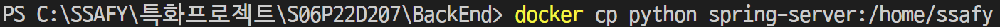
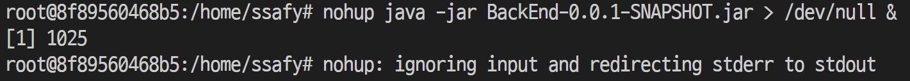

# 포팅 매뉴얼

### 백엔드

우분투를 기준으로 한다. (사진은 윈도우 환경과 우분투가 섞여있다.)

1. docker를 설치한다.

   

2. S06P22D207/BackEnd폴더로 이동한다.

3. ubuntu 도커 이미지를 생성합니다. Dockerfile은 포함되어 있습니다.

   

4. 도커 이미지로 컨테이너를 만들어서 실행합니다.

   

5. maven package 설치

   

6.  jar 파일 생성

   

7. 필요 파일 컨테이너 내부로 이동

   

8. 컨테이너 쉘 접속

9. /home/ssafy로 이동

   

10.  pip 설치

    

11.  numpy, pandas, pymysql, sklearn

    

    pip install pandas

    pip install pymysql

    pip install sklearn

12. mkdir userJSON

    

13. jar 파일 백그라운드에서 실행

    

### 프론트엔드

배포에 실패하였습니다....

아래와 같은 방법으로 시도했지만 실패하였습니다.

[[Nginx\] React 프로젝트 배포하는 방법 (tistory.com)](https://sihus.tistory.com/31) 